This is a [Next.js](https://nextjs.org) that is utilizing Supabase for Auth and Storage

The purpose of this repo is to prove out core product requirements for Supabase including the following:

- [x] Auto creation of anonymous users
- [ ] Account linking with email / password
- [ ] Sign in with email / password
- [ ] Password recovery / reset
- [ ] Account creation with magic link
- [ ] Sign in with magic link
- [ ] Account linking with Google

## Getting Started

### Install dependencies

```bash
# run this the first time and whenever you add additional dependencies
pnpm install
```

### Start the development server

```bash
pnpm dev
```

Open [http://localhost:3000](http://localhost:3000) with your browser to see the result.

# User creation and linking flows

## Auto creation of anonymous users


## SSR of user via cookie

```mermaid
sequenceDiagram
    participant A as Browser
    participant B as NextJS Middleware
    participant C as NextJS Route
    participant D as Supabase Server
    participant E as Supabase Database

    A->>B: Request site<br/>(w/ base64 encoded 🍪)
    B->>B: Parse cookies to get user credentials
    B->>D: Validate user credentials<br/>(and refresh token)
    D->>E: Validate user credentials
    E->>D: Return user
    D->>B: Return user
    B->>C: Request site
    C->>D: Validate user credentials<br/>(and refresh token... again)
    D->>E: Validate user credentials
    E->>D: Return user
    D->>C: Return user
    C->>C: SSR page with user content
    C->>A: Return page
    A->>A: Initialize Redux (with user)
```


