```mermaid
sequenceDiagram
    autonumber
    participant A as Browser
    participant B as NextJS Middleware
    participant C as NextJS Route
    participant D as Supabase Server
    participant E as Supabase Database

    A->>B: Request site<br/>(w/ base64 encoded 🍪)
    B->>B: Parse cookies to get user credentials
    B->>D: Validate user credentials<br/>(and refresh token)
    D->>E: Validate user credentials
    E->>D: Return user
    D->>B: Return user
    B->>C: Request site
    C->>D: Validate user credentials<br/>(and refresh token... again)
    D->>E: Validate user credentials
    E->>D: Return user
    D->>C: Return user
    C->>C: SSR page with user content
    C->>A: Return page
    A->>A: Initialize Redux (with user)
```

This is a [Next.js](https://nextjs.org) app that is utilizing Supabase for Auth and Storage

The purpose of this repo is to prove out core product requirements for Supabase including the following:

- [x] Auto creation of anonymous users
- [ ] Create minimal "Counter" and allow optimistic, persisted storage of the value, per-user
- [ ] Account linking with email / password
- [ ] Sign in with email / password
- [ ] Password recovery / reset
- [ ] Account creation with magic link
- [ ] Sign in with magic link
- [ ] Account linking with Google

## Getting Started

### Install dependencies

```bash
# run this the first time and whenever you add additional dependencies
pnpm install
```

### Start the development server

```bash
pnpm dev
```

Open [http://localhost:3000](http://localhost:3000) with your browser to see the result.

# User creation and linking flows

When we get a request for our site, we first check via cookies to see if there's an existing JWT for a user. Then we refresh that token and pass along the refreshed user object (via a header) from the middleware to the route handler.

## Auto creation of anonymous users

In this flow we're showing what happens for a brand new user. We run through the middlware and serve the page without any SSR user data. Once the site mounts, we create an anonymous user. The credentials for that anonymous user are persisted on the client via a cookie.


<details>
<summary>(Not used) - Auth approach suggested by Supabase which requires an additional server request</summary>


</details>

## SSR of user via cookie

In this flow, the user has already had a JWT injected via a cookie. When they re-request the site, we're able to refresh / validate the JWT and pass along the user object via a header from the middleware to the route handler. We can make any necessary sql queries prior to rendering the page.

```mermaid
sequenceDiagram
    autonumber
    participant A as Browser
    participant B as NextJS Middleware
    participant C as NextJS Route
    participant D as Supabase Server
    participant E as Supabase Database

    A->>B: Request site<br/>(w/ base64 encoded 🍪)
    B->>B: Parse cookies to get user credentials
    B->>D: Validate user credentials<br/>(and refresh token)
    D->>E: Validate user credentials
    E->>D: Return user
    D->>B: Return user
    B->>B: Store user object in header
    B->>C: Request site
    C->>C: Retrieve user object from header
    C->>C: SSR page with user content
    C->>A: Return page
    A->>A: Initialize Redux (with user)
```



<details>
<summary>(Not used) - Auth approach suggested by Supabase</summary>


